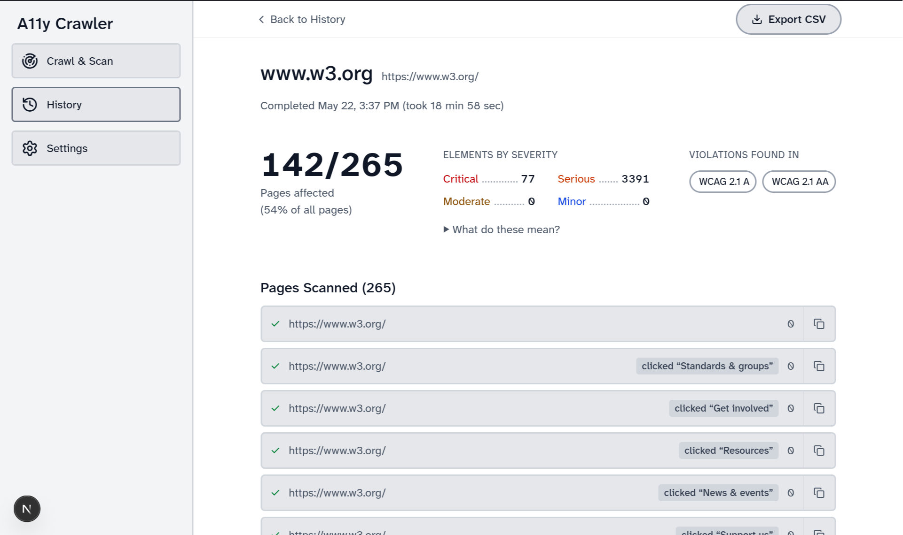

# A11y Crawler

> [!IMPORTANT]
> **This project has merged into [Axcess](https://github.com/lsa-mis/axcess) and is no longer developed here.**
>
> a11y-crawler's page and DOM-state discovery now lives in Axcess, alongside its
> keyboard, focus, responsive, visual, and semantic test pipelines. Please file
> issues and contribute there.
>
> This repository is kept for history and remains available under Apache-2.0.

An automated accessibility auditing tool that discovers all pages and interactive elements in websites or web applications, runs [axe-core](https://github.com/dequelabs/axe-core) WCAG 2.1 AA checks on every discoverable page and interactive state, and presents results in a browser-based dashboard.



## Why This Exists

Modern web applications built with frameworks like React can have dozens or hundreds of pages, with multiple DOM states on a single page. Modals, dropdowns, tabs, accordions, and other interactive elements that each produce unique accessibility surfaces.

During accessibility audits, a human tester must manually navigate to every page, click every interactive element, and run the axe browser extension on each state. This is slow, error-prone, and results in missed pages, especially on large applications with deep navigation structures.

**a11y-crawler automates this process:**

1. Discovers all pages by following every `<a>` link within the application scope.
2. Finds all interactive elements on each page (buttons, tabs, dropdowns, modals, selects, etc.)
3. Clicks each interactive element and scans the resulting DOM state with axe-core.
4. Generates a report with violations grouped by route pattern, and cross-page violation patterns.
5. Opens a real browser window so you can log in to the web app manually, then signals the crawler to continue.

This does not replace manual accessibility testing, such as screen reader behavior, keyboard navigation flow, and contextual judgment require human evaluation. This tool handles the automated scanning portion at scale, helps auditors discover pages they might miss, and lets them focus manual testing effort on the highest-risk areas.

## ⚠️ Safety Warning

**If not specify, the crawler may click every interactive element it finds,** This may include "Delete", "Make Payment", etc.

Before running:
- Use a **test or staging environment**, never production
- Use a **dedicated test account** with non-critical data
- Keep the browser window visible so you can intervene if needed
- Review the **Buttons to avoid** list in the "Advanced options" before starting

## Features

- **Discover all pages and DOM states then run Axe-Core automatically on each link and DOM state**
- **Link discovery** follows all `<a href>` links within a configurable scope
- **Interactive element scanning** clicks buttons, tabs, dropdowns, checkboxes, radio buttons, selects, and elements with ARIA roles or event handlers
- **Authenticated crawling** opens a real browser window, pauses for manual login.
- **WCAG 2.1 AA scanning** runs axe-core with `wcag2a`, `wcag2aa`, and `wcag21aa` tags on every state
- **Cross-page violation aggregation** identifies violations that repeat across multiple pages (likely shared components)
- **Structural DOM hashing** to identify identical page templates (e.g., dynamically generated course pages), bypassing redundant axe scans while still extracting unique outbound links to ensure complete site coverage.
- **Visual feedback** In watch mode, highlights interactive elements before clicking (red border) so you can watch what the crawler is doing
- **Destructive URL blocking** configurable blocklist for logout, delete, and other dangerous URL patterns

## Prerequisites

- macOS, Windows 10+, or Linux
- [Node.js](https://nodejs.org/) 18 or later (LTS version recommended)

### Installing Node.js

**macOS / Linux - direct download:**

1. Go to [nodejs.org](https://nodejs.org/) and download the LTS installer for your platform
2. Run the installer and follow the steps

**macOS - Homebrew:**

```bash
brew install node
```

**Linux - package manager:**
```
Ubuntu/Debian: sudo apt install nodejs
CentOS/Fedora/RHEL: sudo dnf install nodejs
Arch Linux: sudo pacman -S nodejs npm
```

**Windows:**

1. Go to [nodejs.org](https://nodejs.org/) and download the Windows LTS installer (`.msi`)
2. Run the installer - keep all default options selected

Verify the installation afterwards:

```bash
node --version   # should print v18 or higher
npm --version
```


## Installation

### macOS App (.dmg)

1. Download the latest `.dmg` file from the [Releases](https://github.com/harryg02/a11y-crawler/releases) page.
2. Double-click the downloaded `.dmg` file to mount it.
3. Drag the app into your **Applications** folder.
4. **Important**: macOS will refuse to open it the first time, usually saying the app is **"damaged and can't be opened"**. Nothing is damaged and the download is not corrupt, that message is simply what macOS shows for an app it can't verify. We don't pay for an Apple Developer ID certificate, so Apple has nothing to check the app against.
5. **To open it, clear the download flag:**
   - Open your **Terminal** app.
   - Type `xattr -cr ` (including the space at the end).
   - Drag the app from your **Applications** folder into the Terminal window — this fills in the correct path for you.
   - Press **Enter**.
6. You can now open the app normally, and won't need to repeat this for that copy.

> **Why this is needed.** macOS tags anything downloaded from the internet with a
> quarantine flag, and refuses to launch quarantined apps that aren't signed with
> a certificate Apple issued. `xattr -cr` removes that flag. The releases *are*
> ad-hoc signed, which is what lets them run at all on Apple Silicon — but only a
> paid Apple Developer ID would remove the warning itself. Only run `xattr -cr`
> on software you trust and obtained from a source you trust, such as this
> project's own Releases page.

### Download as a ZIP (without Git)

1. Go to the project page on GitHub
2. Click the green **Code** button near the top right
3. Click **Download ZIP**
4. Unzip the downloaded file:
   - **Windows:** right-click the ZIP → **Extract All**, then choose a location
   - **macOS:** double-click the ZIP — it will unzip automatically
5. You now have a folder called `a11y-crawler-main` (or similar) — remember where it is, you'll need it in the next step

### Clone with Git (if you're comfortable with the terminal)

```bash
git clone https://github.com/harryg02/a11y-crawler.git
cd a11y-crawler
```


### Quick start

After installing Node.js, double-click the launcher for your platform:

| Platform | File |
|----------|------|
| macOS | `start.command` |
| Windows | `start.bat` |

> **Windows:** Make sure the project folder path contains no spaces. e.g. `C:\Users\yourname\a11y-crawler` is fine, but `C:\My Projects\a11y crawler` will not work.

The launcher will automatically install dependencies, download the Chromium browser (first run only), start the app, and open it in your browser.

> If something goes wrong, check `start-error.log` in the project folder for details.

### Manual setup

```bash
# 1. Install dependencies
npm install

# 2. Install the Chromium browser used by the crawler
npx playwright install chromium

# 3. Start the app
npm run dev
```

Then open [http://localhost:3000](http://localhost:3000) in your browser.

The app runs entirely on your machine. Scan results are saved as JSON files in the `reports/` folder inside the project.

> To stop the server, press `Ctrl + C` in the terminal.


## What It Scans

1. **Every page** reachable by following `<a>` links within the site's URL scope
2. **Every interactive state** - clicks buttons, tabs, dropdowns, modals, and other elements to expose DOM states that only appear after interaction


## Limitations

- Automated testing catches approximately 30% of WCAG issues. Keyboard navigation flow, screen reader announcements, and color-only information require manual testing with assistive technology.
- The crawler cannot access pages behind different user roles. Run separate scans with different accounts (e.g., student vs. instructor) to cover role-specific pages.
- Some states are only reachable through specific action sequences (e.g., fill out a form, then submit). The crawler clicks elements individually from the initial page state.


## Tech Stack

- [Next.js](https://nextjs.org/) - frontend dashboard
- [Playwright](https://playwright.dev/) - browser automation
- [@axe-core/playwright](https://www.npmjs.com/package/@axe-core/playwright) - WCAG accessibility scanning
- [Tailwind CSS](https://tailwindcss.com/) - styling
- TypeScript


## License

Apache-2.0 — see [LICENSE](LICENSE) and [NOTICE](NOTICE).

Two things worth knowing before you point this at a site:

- **No warranty, no liability.** The scanner drives a real browser against real
  pages, clicking what it finds. Sections 7 and 8 of the License disclaim all
  warranties and limit liability — you run it against a target at your own risk,
  and you are responsible for having permission to scan that target.
- **Attribution is required.** If you redistribute this, including inside a
  commercial product, Section 4 requires you to keep the LICENSE, retain the
  attribution notices, and include the contents of NOTICE in your own notices.
